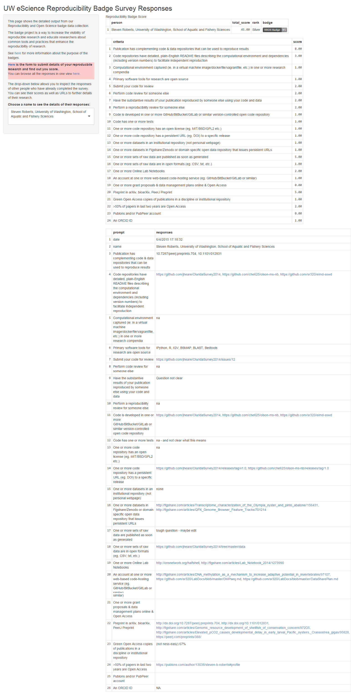

# UW eScience Reproducibility and Open Science Group Web Application for Badges

This repository contains R code for a web application that collects data from the ROS group's survey for issuing badges to recognize efforts to make research more reproducible and open. Anyone is welcome to participate, you can take the survey to find your score here: [http://goo.gl/forms/jm08DOJ2EI](http://goo.gl/forms/jm08DOJ2EI). 

The app connects to the survey results and displays detailed responses for each person, and the score for each item. The responses include clickable URLs so you can easily find each person's reproducible research products. It also shows the total score and the badge colour corresponding to the total score (bronze/silver/gold). 

You can try the app live at: [https://benmarwick.shinyapps.io/ros_badge](benmarwick.shinyapps.io/ros_badge). If this doesn't work it's probably because the free server limit has been exceeded.

You can run the app locally (after installing [RStudio](http://www.rstudio.com/products/RStudio/)) by using the following commands.

```R
# only need to do this once, assming your don't already have the shiny package
install.packages("shiny")
# now download & run the badges application, it will prompt you to install packages if you don't already have them (googlesheets, dplyr, rvest, RCurl, etc.)
shiny::runGitHub('ros_badge', 'benmarwick')
```

Here's a screenshot of the app:




More details are the reproducible research badging program can be found on these pages:

- http://htmlpreview.github.io/?https://github.com/sr320/tmp-badge/blob/master/rros-badge-web.html
- https://github.com/uwescience/reproducible/wiki/%5BDRAFT%5D-Open-Science-and-Reproducible-Badges
- https://github.com/uwescience/reproducible/issues/3

More details about the UW eScience Reproducibility and Open Science Group can be found here:

- http://escience.washington.edu/reproducible
- http://uwescience.github.io/reproducible/
- http://uwescience.github.io/reproducible/guidelines.html

This app was developed with help from [Steven Roberts](https://github.com/sr320) during the [2015 Mozilla Science Lab Sprint](https://www.mozillascience.org/global-sprint-2015) at the [UW eScience Data Science Studio](http://escience.washington.edu/dss).
